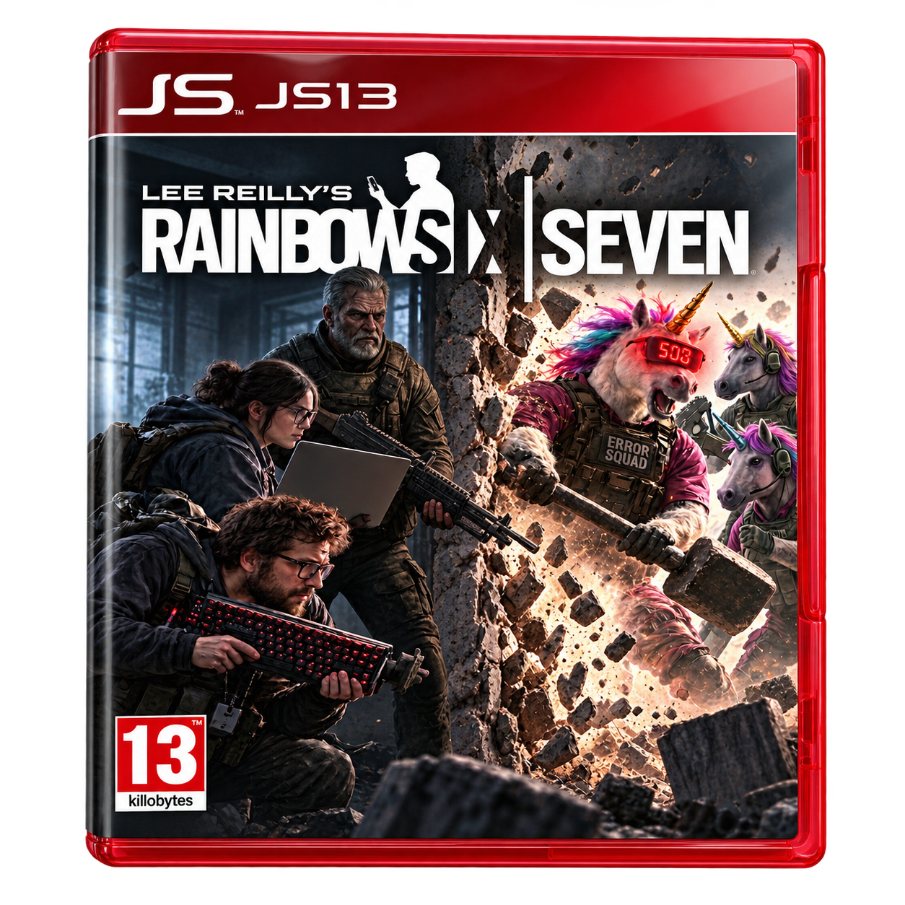
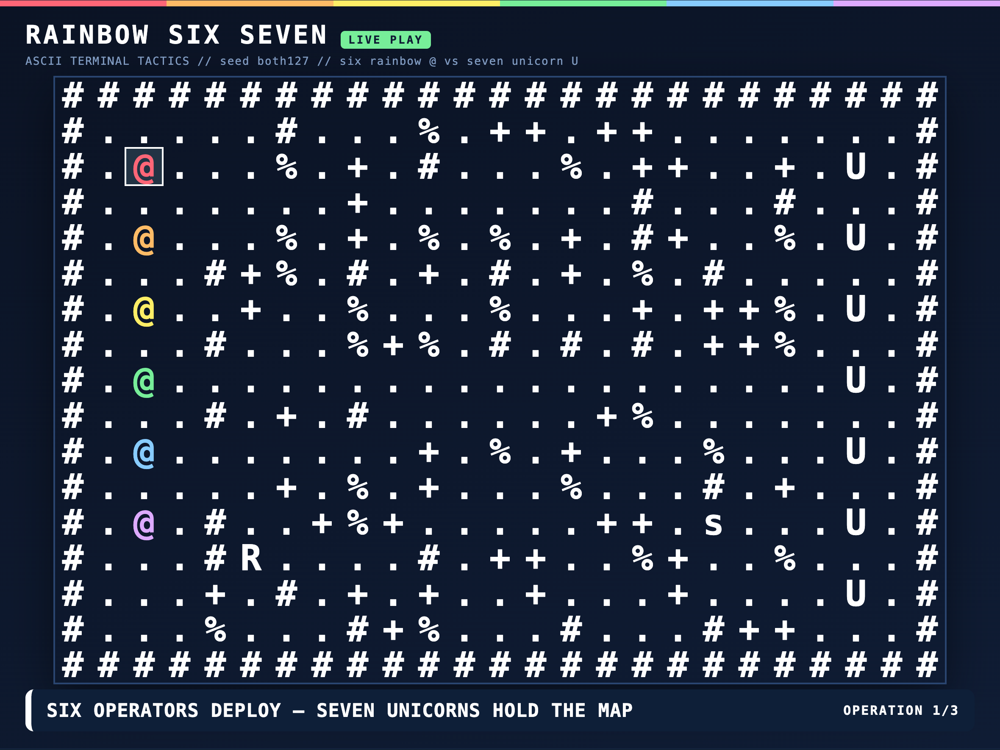

[](https://js13kgames.com/)
[](https://github.com/features/copilot)


Created for [js13kGames](https://js13kgames.com/) competition.
**Theme:** Rainbows and Unicorns. **Constraint:** web only, <= 13KB.

# RAINBOW SIX SEVEN

<p align="center">
  <a href="http://localhost:5173">
    
  </a>
</p>

Lead six rainbow `@` soldiers against seven unicorns in a turn-based ASCII tactics game where cover, clever positioning, and one well-placed rocket can turn the tide.

### [🌈 Play now →](http://localhost:5173)

Start the local server using the development commands below, then follow the play link.



**Controls:** Click / <kbd>Enter</kbd> select, move, or fire · <kbd>←</kbd> <kbd>↑</kbd> <kbd>↓</kbd> <kbd>→</kbd> / WASD move cursor · <kbd>Q</kbd> cycle soldiers · <kbd>F</kbd> aim · <kbd>E</kbd> interact · <kbd>Space</kbd> end turn · <kbd>H</kbd> help

Board shortcuts apply when the battlefield has focus. Use <kbd>Shift</kbd> + <kbd>Q</kbd> to cycle soldiers backward, <kbd>Tab</kbd> to cycle legal targets, and <kbd>Escape</kbd> to cancel aim or dismiss confirmation.

## Features

- **Squad tactics:** activate soldiers in any order, navigate connected terrain, and use destructible cover to block incoming fire.
- **Four distinct weapons:** pistols, mobile rifles, stationary snipers, and limited-ammo rockets with friendly fire and casualty previews before confirmation.
- **ASCII battlefield:** rainbow soldiers, unicorn enemies with charger/flanker/guardian roles, path and threat previews, keyboard navigation, and contrast and reduced-motion options.
- **Multiple objectives:** elimination, relay control, rescue and extraction, plus No Rockets and Deadline challenges.
- **Three-mission operation:** survivors carry their health, weapons, and ammo between missions; choose recovery or resupply at intermissions.
- **Reasons to return:** deterministic UTC daily challenges, shareable replay codes, and local best scores.
- **Offline play:** a single self-contained HTML file with no runtime dependencies, external assets, network access, or compressed loader.

## Development

Requires **Node.js 20+**, npm, and a current browser with ES2022 and CSS `:has` support.

```sh
# Install dependencies
npm install

# Run locally at http://localhost:5173
npm run dev

# Build the submission
npm run build
```

Build output: `dist/index.html`. The build produces a standalone HTML file, not a ZIP archive, and enforces **strictly fewer than 13,000 uncompressed bytes**, including HTML, CSS, and JavaScript. gzip size is reported for reference only.

Open `dist/index.html` directly to play offline, or run `npm run preview` to serve it at `http://localhost:4173`. The generated `dist/` directory is git-ignored.

```sh
# Run mechanics, replay-code, storage, and artifact checks
npm test
```

Source lives in `src/engine.js` (deterministic rules and AI), `src/meta.js` (daily challenges, codes, and local bests), `src/game.js` (UI and controls), and `src/style.css`. esbuild and Terser are build-only dependencies.

For the browser regression, run `npm run build` and `npm run dev`, open `http://localhost:5173/dist/index.html` in Playwright MCP, then execute `scripts/browser-check.js` with `browser_run_code_unsafe`. It exercises the production UI, a complete operation, persistence, and responsive layouts; the source engine is used only as a test oracle.

## Contributing

Contributions welcome! This was a short-lived competition project, so ongoing
maintenance isn't guaranteed. Feel free to fork it and make it your own.

## License

No license file is currently included in this repository; an MIT license has not been declared.
